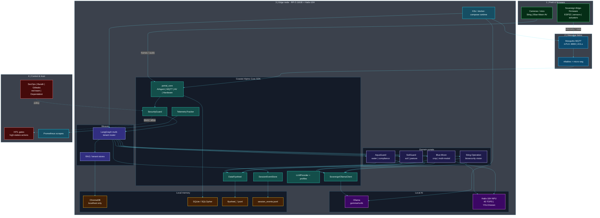
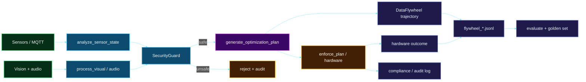
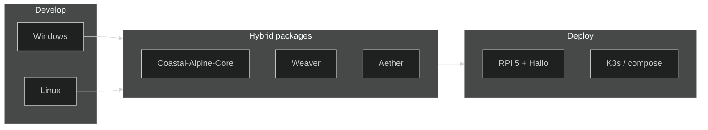

# Coastal Alpine Tech - High-Level Architecture

**Version**: August 2026  
**Status**: Active Development - Enterprise Hardening Phase  
**Canonical hardware**: Raspberry Pi 5 16GB + Hailo-10H NPU (40 TOPS)  
**Core pin**: [v0.5.9](https://github.com/fivepanelhat/Coastal-Alpine-Core/releases/tag/v0.5.9)

---

## 1. Vision

Coastal Alpine Tech builds **sovereign, edge-native AI systems** for New Zealand's primary industries (agriculture, aquaculture, biosecurity). The platform enables local decision-making, data sovereignty (Te Mana Raraunga aligned), and continuous self-improvement while minimising cloud dependency.

Core principles:

- **Edge-first & offline-capable**
- **Data sovereignty** (local processing + owner-controlled keys)
- **HITL governance** on high-stakes decisions
- **Self-improving data flywheels**
- **Production-grade security & observability**

---

## 2. System map (full stack)

The monorepo composes field devices, a message fabric, the Core SDK, multi-tenant orchestration, domain portals, local AI acceleration, and the data flywheel - all on a single edge node (or small K3s fleet).

### Layer table

| # | Layer | Components | Role |
|:-:|:------|:-----------|:-----|
| 1 | **Field** | Sovereign-Edge-Firmware, cameras/mics | Sense physical world; mTLS client identity |
| 2 | **Fabric** | Mosquitto, ACLs, nftables | Encrypted, topic-scoped message bus |
| 3a | **SDK** | Coastal-Alpine-Core | Guards, telemetry, SessionEvent, flywheel, providers, portal_core |
| 3b | **Orchestration** | Weaver (LangGraph) | Multi-tenant routing + RAG + audit emits |
| 3c | **Portals** | AquaGuard, SoilGuard, Blue-Moon, Sting | Domain agents + actuators |
| 3d | **AI** | Ollama + Hailo-10H | Offline LLM + NPU vision |
| 3e | **Memory** | Chroma (local), SQLCipher, JSONL flywheels / session_events | Sovereign stores |
| 4 | **Trust** | HITL, SecOps CI, Prometheus | Governance + observability |

### Sprint A–C Core seams (Aug 2026)

| Seam | Core | Stack adoption |
|------|------|----------------|
| SessionEvent | [v0.5.7](https://github.com/fivepanelhat/Coastal-Alpine-Core/releases/tag/v0.5.7) | Weaver + Aether HITL evidence |
| LLMProvider + profiles | [v0.5.8](https://github.com/fivepanelhat/Coastal-Alpine-Core/releases/tag/v0.5.8) | Soft bridges; local Ollama default |
| Session → Trajectory | [v0.5.9](https://github.com/fivepanelhat/Coastal-Alpine-Core/releases/tag/v0.5.9) | Outcome samples for flywheel / golden-set |

---

## 3. Data-plane map (portal control loop)

Typical path:

1. Sensors / MQTT -> `analyze_sensor_state()`
2. Vision + audio -> `process_visual_feedback()` / `process_audio_feedback()`
3. `SecurityGuard` on all LLM-bound text
4. Multi-modal reasoning -> `generate_optimization_plan()` -> **trajectory recorded**
5. Hardware enforcement -> `enforce_plan()` -> **outcome recorded**
6. Compliance / audit logging
7. Local `flywheel_*.jsonl` for evaluation and golden-set curation

---

## 4. Trust & security plane

| Concern | Implementation | Status |
|---------|----------------|--------|
| Prompt / injection | Core `SecurityGuard` (v0.5.9 patterns) | Strong |
| Tenant isolation | Weaver routing + `tenant_isolated_query` | Strong |
| Session audit | `SessionEventStore` + Trajectory (no secrets) | Strong |
| Transit | mTLS MQTT :8883, ACLs, nftables | Strong |
| Supply chain | Dependabot, Gitleaks, Bandit, red-team | Strong |
| Vector DB | Chroma **localhost-only** until upstream RCE patch | Mitigated |
| Secrets | No tool-written API keys; env / operator `.env` | Strong |
| Observability | `TelemetryTracker` + Prometheus | Good |
| Deployment | K3s manifests + `PRODUCTION_HARDENING.md` | Good |

Detail: [`SECURITY.md`](./SECURITY.md) | [`SECURITY_MATRIX.md`](./SECURITY_MATRIX.md) | [`THREAT_MODEL.md`](./THREAT_MODEL.md)

---

## 5. Component catalogue

### 5.1 Coastal-Alpine-Core (shared foundation)

- `SecurityGuard` / `SecurityResult` - prompt, SSRF-lure, SQL, credential patterns
- `TelemetryTracker` - latency, optional system metrics
- `SessionEventStore` / `make_event` - append-only HITL evidence stream
- `DataFlywheel` / `record_session_trajectory` - trajectories, HITL feedback, golden sets
- `LLMProvider` Protocol + edge profiles (`get_provider`)
- `SovereignOllamaClient` - keep-alive session, edge defaults, LRU cache
- `portal_core` - AIAgent, MQTTClient, AVCapture, HardwareController, MediaPruner

### 5.2 Weaver (orchestration)

- Multi-tenant LangGraph orchestrator
- Security + telemetry + SessionEvent + Trajectory on process paths
- Tenant-aware routing between specialist agents
- Dual-platform install (`install.sh` / `install.ps1` / `bootstrap.py`)
- Core pin: `@v0.5.9`

### 5.3 Aether (hybrid companion)

- ReAct agentic development orchestrator
- Markdown skills (`kiwi-edge-architecture`, security, sovereignty)
- Soft SessionEvent + Trajectory bridges (optional `aether[core]`)
- **Computer use** hybrid: desktop actuation on Windows + Linux
- HITL gates aligned with stack trust plane
- Install: `install.sh` (Linux) | `install.ps1` (Windows)

### 5.4 Dual-platform hosts

| Role | Platform | Installer |
| :--- | :--- | :--- |
| Dev workstation | Windows 10/11 | `install.ps1` |
| Dev workstation | Linux / macOS | `install.sh` |
| Production edge | RPi 5 16GB + Hailo-10H (Linux) | `install.sh` + compose/K3s |

### 5.5 Domain portals

| Portal | Domain | Key capabilities |
|--------|--------|------------------|
| Blue-Moon-Portal | Microgreens / protected cropping | Multi-modal sensor + vision + audio |
| AquaGuard-Portal | Aquaculture / water | Water quality + compliance |
| SoilGuard-Portal | Pasture / soil | Nutrients + soil health |
| Sting-Operation-AI | Biosecurity (wasps) | YOLO / Hailo vision inference |

### 5.6 Hardware & deployment

- **Edge nodes**: Raspberry Pi 5 16GB + Hailo-10H
- **Runtime**: K3s or docker-compose (`k8s/`, `docker-compose.yml`)
- **LLM**: Ollama (`gemma4:e4b` default)
- **Firmware**: Sovereign-Edge-Firmware (ESP32, mTLS MQTT)

---

## 6. Maturity (August 2026)

| Area | Status |
|------|--------|
| Core SDK | Production foundations + Sprint A–C seams (0.5.9) |
| Portals | Flywheel + SecurityGuard integrated |
| CI / SecOps | Enterprise CI, secops, red-team, Dependabot |
| Deployment | K3s manifests + hardening guide |
| Self-improvement | Collection + evaluation; Bayesian hooks on roadmap |

---

## 7. Related documentation

| Document | Description |
|----------|-------------|
| [README.md](./README.md) | Front-page overview + system map |
| [DATA_FLYWHEEL_GUIDE.md](./DATA_FLYWHEEL_GUIDE.md) | Self-improvement loop |
| [SECURITY_POSTURE_REPORT.md](./SECURITY_POSTURE_REPORT.md) | Live threat register |
| [PRODUCTION_HARDENING.md](./PRODUCTION_HARDENING.md) | Enterprise deployment |
| [THREAT_MODEL.md](./THREAT_MODEL.md) | Threat / defence matrix |

---

*Maintained by Coastal Alpine Tech Limited - Taranaki, Aotearoa New Zealand*
