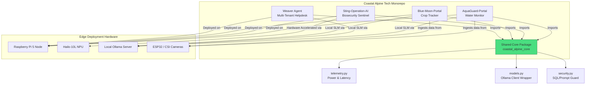

# Coastal Alpine Stack: Edge Agentic AI Workspace (v1.2.0)

**Coastal Alpine Tech Limited**  
*Edge AI | Sovereign Systems | Practical Intelligence*

[](LICENSE)  
[](https://www.python.org/)  
[]()  
[](https://github.com/fivepanelhat/coastal-alpine-stack/actions)

A unified sovereign edge AI ecosystem coordinating biosecurity sentinels, autonomous agricultural control, and heavy-industry client compliance.

---

**Problem we are solving is:** The reliance on cloud-based AI infrastructure introduces severe data leakage risks, operational latencies, and connectivity dependencies for critical NZ industries. The Coastal Alpine Stack provides a fully edge-native, sovereign, and multi-tenant AI ecosystem tailored for New Zealand's agritech, biosecurity, and industrial compliance sectors.

- **Who:** Built by Wayne Roberts, Coastal Alpine Tech Limited for heavy industry and primary production sectors.
- **Where:** Engineered at HQ in New Plymouth, Taranaki. Designed for on-premise and offline edge deployment in remote NZ environments.
- **What:** A cohesive suite of edge-deployed, multi-agent systems and real-time vision pipelines running locally on energy-efficient hardware.
- **Why:** To secure operational data, ensure zero external network dependencies, and provide real-time decision-making where connectivity is intermittent or non-existent.
- **When:** Active development as of June 2026.

---

## The Problems We Are Solving

1. **Cloud Dependability & Intermittent Connectivity** — Remote farms, forestry blocks, and construction sites lose connection frequently. The stack operates 100% offline at the edge.
2. **Data Sovereignty & Client Isolation** — High-compliance industrial sectors cannot permit client operational data to leak to the public cloud or cross-contaminate. The stack enforces strict service-level and DB-level tenant boundaries.
3. **Pest Control Harm to Beneficial Species** — Standard broad-spectrum pest control destroys native and beneficial insect populations. The stack uses precision YOLO detection to target pests while sparing beneficial honeybees.

---

## Key Features

- **Decentralized Multi-Agent Scaffolding:** Advanced LangGraph state machines routing query responses, tasks, and logging.
- **Precision Computer Vision:** Custom YOLOv8 OBB (Oriented Bounding Box) model trained on NZ-specific species.
- **Multi-Modal Telemetry Analysis:** Integrates light, humidity, and soil sensors alongside camera captures.
- **Hardware-Aware Performance:** Low-power edge metrics and optimized local SLM inference.
- **Shared Core integration:** A common `coastal-alpine-core` package enabling input guards, connection fallbacks, and diagnostics telemetry.
- **Hardware SecOps Enforcer:** High-security system configuration locking bootloader interfaces and system volumes.

---

## Quick Start

### Prerequisites

- Raspberry Pi 5 (16GB RAM) + Hailo-10L accelerator (or virtualized NPU mappings)
- Python 3.10+
- Ollama with Gemma 4 model (`gemma4:e4b`)
- MQTT broker (e.g. Mosquitto)

### Installation & System SecOps Provisioning

1. **Lock down the hardware perimeter** (on the Pi 5 target):
   ```bash
   chmod +x ./rpi_secops/secure_boot_setup.sh
   ./rpi_secops/secure_boot_setup.sh
   ```
   *Note: This stages the EEPROM security parameters, configures PCIe Gen 3/NPU device overlays, and configures the read-only root system layouts.*

2. **Clone and build Python environment**:
   ```bash
   git clone https://github.com/fivepanelhat/coastal-alpine-stack.git
   cd coastal-alpine-stack

   python -m venv .venv
   source .venv/bin/activate  # Windows: .venv\Scripts\activate

   # Install shared core in editable mode
   pip install -e ./coastal_alpine_core
   pip install -r requirements-dev.txt
   ```

### Model Setup

```bash
ollama pull gemma4:e4b
```

### Run

```bash
# Check the shared core modules
python -c "import coastal_alpine_core; print('Core OK')"
```

---

## Architecture Overview

The system runs completely local, utilizing a shared core library to power safety, telemetry, and connection fallbacks across the products.



*For more details on the architecture of each individual repo, see their sub-directories. You can edit the Mermaid diagram directly in this README.*

---

## Directory Structure

```bash
coastal-alpine-stack/
├── coastal_alpine_core/       # Shared Python library for telemetry & LLM controls
├── AquaGuard-Portal/          # Autonomous Water Quality & Aquaculture Monitor
├── Blue-Moon-Portal/          # Agritech IoT Crop Optimization Portal
├── Sting-Operation-AI/        # Real-time computer vision wasp detection sentinel
├── weaver/                    # White-label multi-tenant governance agent scaffold
├── LICENSE                    # Monorepo MIT License
├── README.md                  # This entry point
├── CHANGELOG.md               # Unified change log
└── CONTRIBUTING.md            # Stack-wide development standards
```

---

## Technology Stack

**Hardware**  
- Raspberry Pi 5 (16GB RAM)
- Hailo-10L NPU PCIe HAT (13 TOPS)
- CSI Camera module, USB microphone, ESP32 microcontrollers

**Software**  
- **Orchestration:** LangGraph (StateGraph compiler)
- **Inference:** local Ollama (Gemma 4 / Phi-4 / Granite)
- **Computer Vision:** YOLOv8 OBB (Oriented Bounding Box) models
- **Data:** SQLAlchemy with `pgvector` multi-tenant database schema
- **Messaging:** Paho MQTT
- **Deployment:** systemd daemons, Docker Compose

---

## Documentation

- [weaver/README.md](./weaver/README.md) — Weaver Agents documentation
- [AquaGuard-Portal/README.md](./AquaGuard-Portal/README.md) — AquaGuard-Portal documentation
- [Blue-Moon-Portal/README.md](./Blue-Moon-Portal/README.md) — Blue-Moon-Portal documentation
- [Sting-Operation-AI/README.md](./Sting-Operation-AI/README.md) — Sting-Operation-AI documentation
- [CHANGELOG.md](./CHANGELOG.md) — Version history
- [CONTRIBUTING.md](./CONTRIBUTING.md) — Contribution guidelines

---

## Performance & Benchmarks

Our tests run locally on the Raspberry Pi 5 to record execution time and power footprint:
- **Ollama Gemma 4 (INT4):** ~14.5 tokens/sec execution speed under active CPU workload (~9.2W average power).
- **YOLOv8 OBB (INT8):** Wasp detection pipeline processing a frame in <12.5ms using Hailo-10L NPU (~1.2W active NPU draw).

---

## Real-World Applications

- **Kiwi AgriTech:** Automation in microgreen houses in Horowhenua, processing sensory telemetry offline.
- **Biosecurity sentinels:** Apiary hive gates deployed to actively zap invasive wasps while allowing bees to enter.
- **Heavy Industry Helpdesk:** Regional civil construction sites querying safety runbooks with absolute client isolation.

---

## Contributing

Contributions are welcome. Please see [CONTRIBUTING.md](./CONTRIBUTING.md).

---

## License

Licensed under the MIT License — see [LICENSE](./LICENSE) for details.

---

**Built with focus on data sovereignty and edge intelligence.**  
Questions or collaboration? Contact Coastal Alpine Tech Limited.

---

*Last updated: June 2026*
