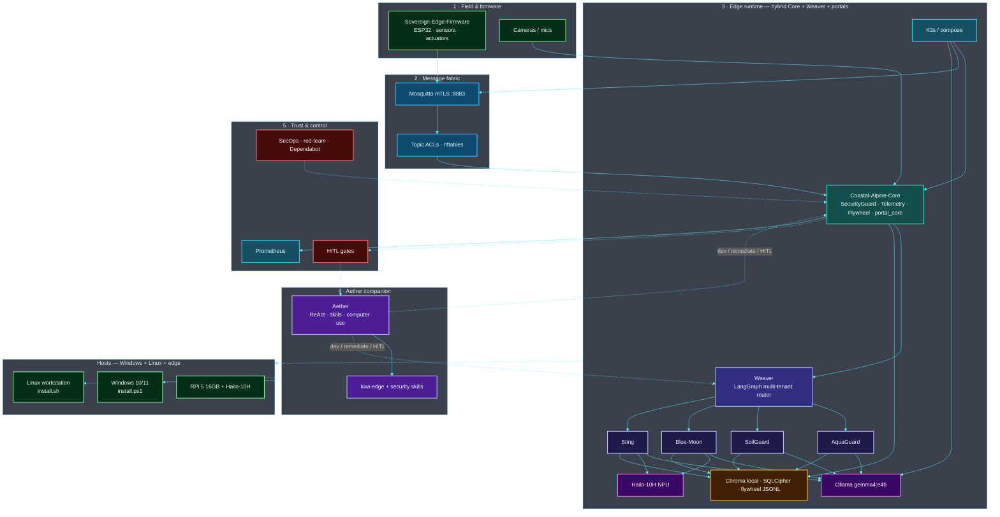

# Coastal Alpine Stack — Sovereign Edge AI Platform


**Coastal Alpine Tech Limited**  
*Edge-Native | Data Sovereign | Self-Improving*


A production-grade, sovereign edge AI ecosystem for New Zealand’s primary industries (agriculture, aquaculture, biosecurity). Designed for offline operation, strict data sovereignty, and continuous self-improvement.

---

## Recent Major Improvements (July 2026)

- **Hybridised stack** — Core · Weaver · Aether · monorepo unified for **Windows + Linux** (edge remains RPi 5)
- **Enhanced system map** — multi-plane Mermaid + liquid-glass overview (field → fabric → runtime → companion → trust)
- **Dual-platform installers** — `install.sh` (Linux/macOS) + `install.ps1` (Windows) + `bootstrap.py`
- **Core SDK 0.5.x** — edge optimisations, expanded `SecurityGuard`, flywheel rotation
- **Aether companion** — ReAct skills, HITL gates, computer use for sovereign development
- **Security notifications** — Dependabot estate-wide, least-privilege CI, GHSA floors
- **Full Data Flywheel** — plan generation + hardware outcome recording across portals
- **Production deployment** — K3s manifests + `PRODUCTION_HARDENING.md`

---

## Architecture Overview

The stack repo composes the full **sovereign edge runtime**: field firmware → mTLS MQTT → Core SDK → Weaver → domain portals → Ollama + Hailo-10H, hybridised with the **Aether** agentic companion. **Develop on Windows or Linux; deploy on RPi 5 16GB**.

<p align="center">
  
</p>

### System map

Five planes: **field**, **fabric**, **runtime apps**, **companion**, and **trust** — with dual-platform host paths.



| Plane | Components | Role |
| :--- | :--- | :--- |
| **Field** | Sovereign-Edge-Firmware, cameras/mics | Sense + actuate on-site |
| **Fabric** | Mosquitto mTLS, ACLs, nftables | Encrypted, micro-segmented bus |
| **SDK** | Coastal-Alpine-Core | Guards, telemetry, flywheel, portal_core |
| **Orchestration** | Weaver | Multi-tenant routing + RAG |
| **Portals** | AquaGuard · SoilGuard · Blue-Moon · Sting | Domain agents |
| **Companion** | Aether | Agentic dev, skills, computer use, HITL |
| **AI** | Ollama + Hailo-10H | Offline LLM + NPU vision |
| **Trust** | HITL, SecOps, Prometheus | Governance + observability |
| **Hosts** | Windows · Linux · RPi 5 | Dual-platform install; edge production |

*Full maps (data plane + trust plane): [ARCHITECTURE.md](./ARCHITECTURE.md)*

## Documentation

| Document                        | Description                                      |
|--------------------------------|--------------------------------------------------|
| `ARCHITECTURE.md`              | High-level system architecture                   |
| `DATA_FLYWHEEL_GUIDE.md`       | Complete guide to the self-improving data flywheel |
| `SECURITY_POSTURE_REPORT.md`   | Security & hardening status across the stack     |
| `PRODUCTION_HARDENING.md`      | Enterprise / government deployment recommendations |

---

## Quick Links to Repositories

| Repo | Role | Platforms |
| :--- | :--- | :--- |
| [Coastal-Alpine-Core](https://github.com/fivepanelhat/Coastal-Alpine-Core) | Shared Python SDK | Windows · Linux · RPi |
| [Weaver](https://github.com/fivepanelhat/Weaver) | Multi-tenant orchestration | Windows · Linux · RPi |
| [Aether](https://github.com/fivepanelhat/Aether) | Agentic companion + computer use | Windows · Linux · macOS |
| [Blue-Moon-Portal](./Blue-Moon-Portal) | Crop optimisation | Edge Linux |
| [AquaGuard-Portal](./AquaGuard-Portal) | Water quality & aquaculture | Edge Linux |
| [SoilGuard-Portal](./SoilGuard-Portal) | Soil & pasture health | Edge Linux |
| [Sting-Operation-AI](./Sting-Operation-AI) | Biosecurity vision | Edge Linux + Hailo |

---

## Getting Started (Windows + Linux)

**Requirements:** Python 3.10+ (stack workspace prefers 3.11+), Git, Docker optional for compose.

### One-line install

<details open>
<summary><strong>🐧 Linux / macOS</strong></summary>

```bash
curl -fsSL https://raw.githubusercontent.com/fivepanelhat/coastal-alpine-stack/main/install.sh | bash
```

</details>

<details>
<summary><strong>🪟 Windows (PowerShell)</strong></summary>

```powershell
irm https://raw.githubusercontent.com/fivepanelhat/coastal-alpine-stack/main/install.ps1 | iex
```

> **Note:** If script execution is blocked: `Set-ExecutionPolicy -Scope CurrentUser RemoteSigned`

</details>

### From a clone

<details open>
<summary><strong>🐧 Linux / macOS</strong></summary>

```bash
git clone --recurse-submodules https://github.com/fivepanelhat/coastal-alpine-stack.git
cd coastal-alpine-stack

python3 -m venv .venv
source .venv/bin/activate
pip install -U pip
pip install -e "./coastal_alpine_core[dev]"
pip install -r requirements-dev.txt

# Optional: Docker edge stack
# docker compose up -d
```

**System packages (Debian/Ubuntu/RPi OS):**

```bash
sudo apt-get update
sudo apt-get install -y python3-dev python3-venv python3-pip git build-essential
# Optional edge: docker.io docker-compose-v2
```

</details>

<details>
<summary><strong>🪟 Windows (PowerShell)</strong></summary>

```powershell
git clone --recurse-submodules https://github.com/fivepanelhat/coastal-alpine-stack.git
cd coastal-alpine-stack

python -m venv .venv
.\.venv\Scripts\Activate.ps1
python -m pip install -U pip
pip install -e "./coastal_alpine_core[dev]"
pip install -r requirements-dev.txt

# Optional: Docker Desktop + compose for local edge services
# docker compose up -d
```

**Prerequisites:** [Python 3.10+](https://www.python.org/downloads/) (PATH enabled), [Git for Windows](https://git-scm.com/), optional [Docker Desktop](https://www.docker.com/products/docker-desktop/).

</details>

### Companion (Aether)

Install Aether alongside the stack for skills, remediation, and computer use:

| OS | Command |
| :--- | :--- |
| Linux / macOS | `curl -fsSL https://raw.githubusercontent.com/fivepanelhat/Aether/main/install.sh \| bash` |
| Windows | `irm https://raw.githubusercontent.com/fivepanelhat/Aether/main/install.ps1 \| iex` |

---

## License

Proprietary — Coastal Alpine Tech Limited

---

*Last major update: July 2026*

---

## Project badges

Status badges for this repository (CI, security, license, and stack metadata):

[](LICENSE)  
[](https://www.python.org/)  
[]()  
[]()  
[]()  
[]()  
[]()  
[]()  
[](https://github.com/fivepanelhat/coastal-alpine-stack/actions/workflows/ci-scan.yml)  
[](https://github.com/fivepanelhat/coastal-alpine-stack/actions/workflows/secops.yml)  
[](https://github.com/fivepanelhat/coastal-alpine-stack/actions/workflows/redteam.yml)  
[]()  
[]()  
[]()
