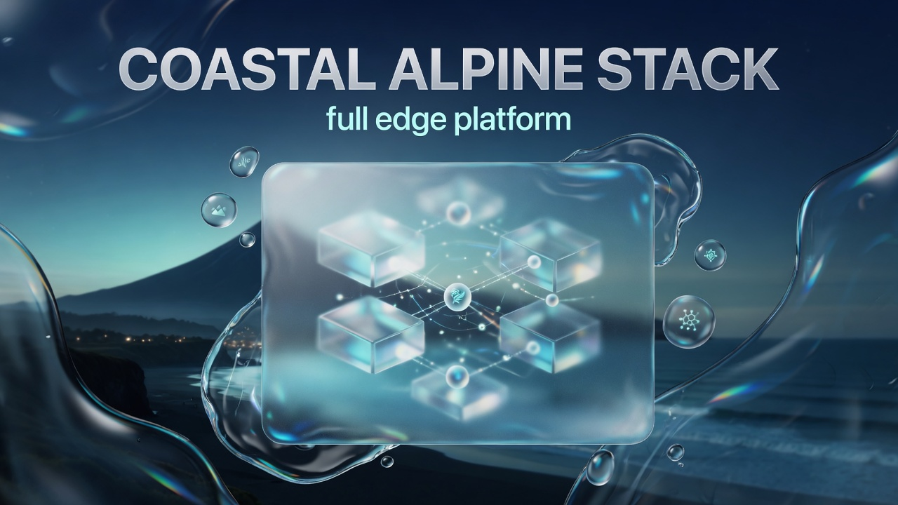
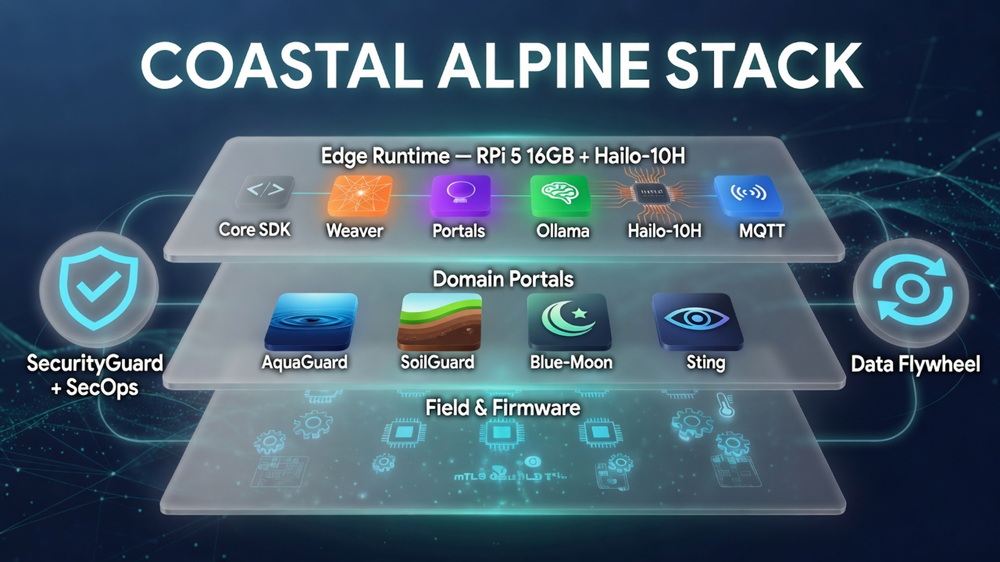
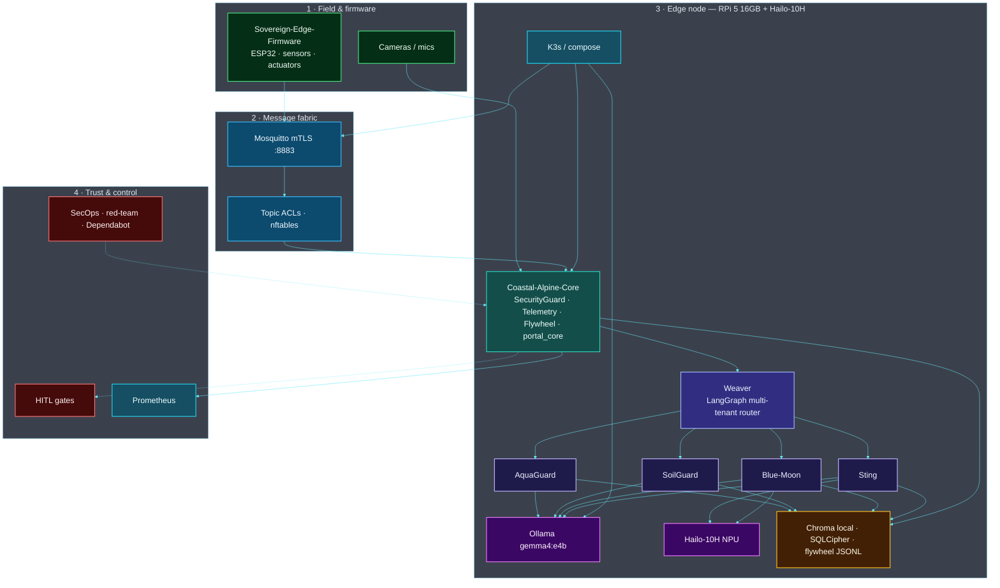

# Coastal Alpine Stack — Sovereign Edge AI Platform




**Coastal Alpine Tech Limited**  
*Edge-Native | Data Sovereign | Self-Improving*


A production-grade, sovereign edge AI ecosystem for New Zealand’s primary industries (agriculture, aquaculture, biosecurity). Designed for offline operation, strict data sovereignty, and continuous self-improvement.

---

## Recent Major Improvements (July 2026)

- **Enhanced system map** — multi-plane Mermaid + liquid-glass overview (field → fabric → runtime → trust)
- **Core SDK 0.5.x** — edge optimisations, expanded `SecurityGuard`, flywheel rotation
- **Security notifications** — Dependabot estate-wide, least-privilege CI, GHSA floors
- **Full Data Flywheel** — plan generation + hardware outcome recording across portals
- **Production deployment** — K3s manifests + `PRODUCTION_HARDENING.md`

---

## Architecture Overview

The stack repo composes the full **sovereign edge runtime**: field firmware → mTLS MQTT → Core SDK → Weaver → domain portals → Ollama + Hailo-10H, with SecurityGuard, SecOps, and the data flywheel on **RPi 5 16GB**.

<p align="center">
  
</p>

### System map

Four planes on one edge node: **field**, **fabric**, **runtime apps**, and **trust**.



| Plane | Components | Role |
| :--- | :--- | :--- |
| **Field** | Sovereign-Edge-Firmware, cameras/mics | Sense + actuate on-site |
| **Fabric** | Mosquitto mTLS, ACLs, nftables | Encrypted, micro-segmented bus |
| **SDK** | Coastal-Alpine-Core | Guards, telemetry, flywheel, portal_core |
| **Orchestration** | Weaver | Multi-tenant routing + RAG |
| **Portals** | AquaGuard · SoilGuard · Blue-Moon · Sting | Domain agents |
| **AI** | Ollama + Hailo-10H | Offline LLM + NPU vision |
| **Trust** | HITL, SecOps, Prometheus | Governance + observability |

*Full maps (data plane + trust plane): [ARCHITECTURE.md](./ARCHITECTURE.md)*

## Documentation

| Document                        | Description                                      |
|--------------------------------|--------------------------------------------------|
| `ARCHITECTURE.md`              | High-level system architecture                   |
| `DATA_FLYWHEEL_GUIDE.md`       | Complete guide to the self-improving data flywheel |
| `SECURITY_POSTURE_REPORT.md`   | Security & hardening status across the stack     |
| `PRODUCTION_HARDENING.md`      | Enterprise / government deployment recommendations |

---

## Quick Links to Repositories

- [Coastal-Alpine-Core](./coastal_alpine_core) — Shared Python SDK
- [Weaver](./weaver) — Multi-tenant orchestration
- [Blue-Moon-Portal](./Blue-Moon-Portal) — Crop optimisation
- [AquaGuard-Portal](./AquaGuard-Portal) — Water quality & aquaculture
- [SoilGuard-Portal](./SoilGuard-Portal) — Soil & pasture health
- [Sting-Operation-AI](./Sting-Operation-AI) — Biosecurity vision

---

## Getting Started

See individual repository READMEs for setup instructions.

**Core requirement**: Python 3.10+

```bash
# Example: Install shared core
pip install -e ./coastal_alpine_core[dev]
```

---

## License

Proprietary — Coastal Alpine Tech Limited

---

*Last major update: July 2026*

---

## Project badges

Status badges for this repository (CI, security, license, and stack metadata):

[](LICENSE)  
[](https://www.python.org/)  
[]()  
[]()  
[]()  
[](https://github.com/fivepanelhat/coastal-alpine-stack/actions/workflows/ci-scan.yml)  
[](https://github.com/fivepanelhat/coastal-alpine-stack/actions/workflows/secops.yml)  
[](https://github.com/fivepanelhat/coastal-alpine-stack/actions/workflows/redteam.yml)  
[]()  
[]()  
[]()
