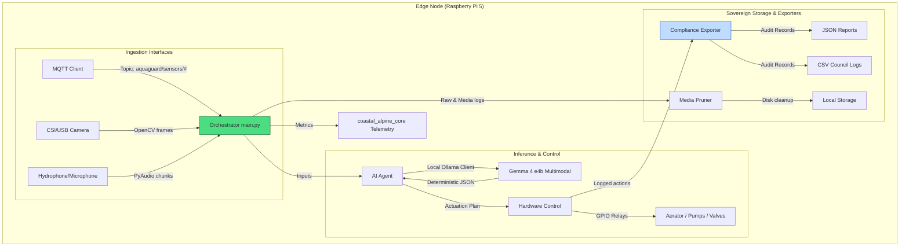

# AquaGuard Portal Architecture

This document outlines the software and data flow architecture of the **AquaGuard Portal** environmental monitor. Designed for edge deployment in remote, offline New Zealand environments, the system ensures data sovereignty while maintaining real-time intelligence.

## System Design Overview

AquaGuard operates as an event-driven edge orchestrator on a Raspberry Pi 5 equipped with a Hailo NPU. It processes sensor streams, processes image/audio feed data via a local multimodal Gemma 4 model, actuates hardware loops, and persists records locally.

## Architectural Layers

1. **Ingestion Layer (`portal_core/mqtt_client.py`, `portal_core/av_capture.py`)**
 - **MQTT Client:** Subscribes to ESP32 telemetry. Receives telemetry data (pH, DO, temperature, turbidity, nitrate) and buffers it in an asynchronous queue.
 - **AV Capture:** Captures CSI/USB camera frames and audio chunk streams. In non-hardware environments, it falls back to generating structured test inputs (such as mock static images representing water clarity or sine waves representing pump noise).

2. **Inference Layer (`portal_core/ai_agent.py`)**
 - Utilizes `coastal_alpine_core.SovereignOllamaClient` to connect to Ollama.
 - Executes multimodal prompts. The Gemma 4 (`gemma4:e4b`) model receives the current telemetry readings, visual frames (analyzing sediment or fish behaviour), and audio feedback (checking for pump vibrations or water leak sounds).
 - Generates deterministic command payloads, validated using Pydantic schemas.

3. **Actuation Layer (`portal_core/hardware_control.py`)**
 - Controls physical relays via GPIO mapping.
 - Actuates **aerators** (in response to low Dissolved Oxygen), **water pumps** (in response to temperature/turbidity issues), **valves** (for dairy effluent systems), or triggers **alarm relays**.

4. **Compliance & Storage Layer (`portal_core/compliance_exporter.py`, `portal_core/media_pruner.py`)**
 - **Compliance Exporter:** Translates system outcomes, sensor data, and actuation details into audit logs. Writes logs in JSON and CSV formats formatted to meet regional council Permitted Activity audit formats.
 - **Media Pruner:** Monitored by a background task, the pruner manages disk usage. It deletes transient camera frames and audio recordings after a configured retention window (e.g. 48 hours) while safeguarding structural compliance files.
