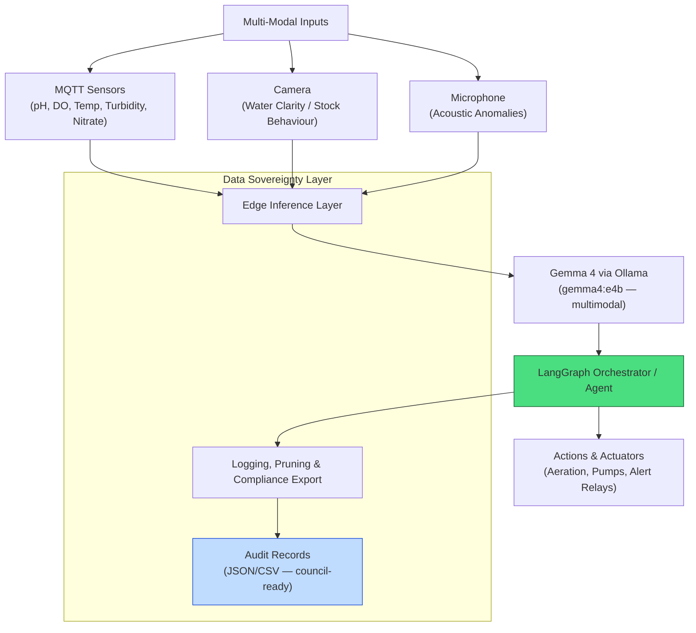

# AquaGuard Portal

[](https://github.com/fivepanelhat/AquaGuard-Portal/actions/workflows/secops.yml)
[](https://github.com/fivepanelhat/AquaGuard-Portal/actions/workflows/redteam.yml)

 


**Coastal Alpine Tech Limited**  
*Edge AI | Sovereign Systems | Practical Intelligence*

[](LICENSE)  
[](https://www.python.org/)  
  
  
  
[](https://github.com/fivepanelhat/AquaGuard-Portal/actions)  
[](https://github.com/fivepanelhat/AquaGuard-Portal/actions/workflows/secops.yml)  
[](https://github.com/fivepanelhat/AquaGuard-Portal/actions/workflows/redteam.yml)  
  

Autonomous on-premise multi-modal environmental and water quality monitoring system for New Zealand aquaculture and dairy farms using edge AI. Designed for full offline operation in remote coastal and rural environments.

---

## The 5 Ws: Project Context

- **Who:** Built by Coastal Alpine Tech Limited, in partnership with NZ aquaculture operators, dairy farmers, and tāngata whenua with interests in freshwater and coastal environments.
- **What:** A multi-modal, agentic IoT pipeline that ingests sensor telemetry, visual, and acoustic data to autonomously monitor water quality, detect anomalies, optimise operations, and generate audit-ready compliance records.
- **Where:** Deployed on-site for marine aquaculture operations (mussel, salmon, oyster farms), land-based aquaculture, or dairy effluent management systems. Engineered at HQ in New Plymouth, Taranaki.
- **When:** Active development as of June 2026.
- **Why:** To deliver localised data sovereignty and real-time decision intelligence — without cloud latency or privacy risks — in New Zealand's remote or regulated aquatic environments. Compliance record-keeping is built into the data model from day one.

---

## The Problem We Are Solving

The problem we are solving is the lack of reliable, offline-capable, multi-modal monitoring in NZ aquaculture and dairy farming, which leads to delayed responses to water quality issues, environmental non-compliance, and suboptimal production outcomes.

Additional challenges addressed:

1. **Cloud Dependency & Connectivity** — Remote coastal farms and marine sites frequently lose internet, making cloud-based monitoring unreliable and creating gaps in mandatory environmental records.
2. **Fragmented Sensor Data** — Disparate water parameters (pH, dissolved oxygen, temperature, turbidity, nitrate) and visual/acoustic cues are rarely analysed together in real time.
3. **Regulatory Compliance Burden** — New Zealand's freshwater and marine regulations (NES-F, NES-MA, Freshwater Farm Plans) require auditable, timestamped, sovereign data records that third-party cloud services cannot reliably guarantee.
4. **Tāngata Whenua Data Sovereignty** — Under the NPS-FM 2020 hierarchy of *Te Mana o te Wai*, iwi and hapū have legal standing in freshwater management decisions. Monitoring data that informs those decisions must remain in the custody of those who generate it.
5. **Effluent Consent Monitoring** — Regional council permitted activity rules require continuous, documented compliance monitoring of dairy effluent systems — 365 days a year.

---

## Key Features

- Multi-modal input processing (MQTT water sensors, underwater/above-water cameras, microphone)
- Local Gemma 4 inference via Ollama — multimodal (text + image) — for analysis, prediction, and control
- Edge-native execution with full offline capability
- Automated data logging and media pruning
- Deterministic outputs via Pydantic schemas
- Compliance record export (JSON + CSV) formatted for regional council reporting
- Systemd service for persistent, unattended operation
- Hardware control (aeration, pumps, alert relays, effluent management)
- Audit trail generation compatible with Freshwater Farm Plan requirements

---

## Quick Start

### Prerequisites

#### Hardware (NZ-available)

- Raspberry Pi 5 (16GB RAM) — available from [PB Tech](https://www.pbtech.co.nz) and [Kiwi Electronics](https://www.kiwi-electronics.com)
- **Raspberry Pi AI Accelerator / AI HAT+ 2** (40 TOPS, Hailo-10H NPU) — available from [PB Tech](https://www.pbtech.co.nz/product/SEVRBP0545) and Kiwi Electronics  
  *Canonical target: AI HAT+ 2 / Hailo-10H (40 TOPS) for multi-model and generative workloads*
- Water quality sensors (pH, DO, temperature, turbidity) via ESP32 over MQTT
- CSI or USB camera module (appropriate IP67/IP68 underwater housing for aquatic deployment)
- Hydrophone or directional microphone (optional, for acoustic anomaly detection)
- Python 3.10+
- Ollama with Gemma 4 edge model
- Local MQTT broker (Mosquitto)

> **Canonical edge target:** **Raspberry Pi 5 (16GB)** with **Hailo-10H NPU** (40 TOPS) via the Raspberry Pi AI Accelerator / AI HAT+ 2. Available in New Zealand via PB Tech and Kiwi Electronics.

### Installation

```bash
git clone https://github.com/fivepanelhat/AquaGuard-Portal.git
cd AquaGuard-Portal

python -m venv venv
source venv/bin/activate  # Windows: venv\Scripts\activate

# Install shared core and dependencies
pip install git+https://github.com/fivepanelhat/coastal-alpine-core.git
pip install -r requirements.txt
pip install -r requirements-dev.txt
cp .env.example .env
```

### Model Setup & Validation

```bash
ollama serve          # In one terminal
ollama pull gemma4:e4b   # Efficient 4B — recommended for RPi 5 (16GB RAM)
# Alternative for AI HAT+ 2 (40 TOPS): ollama pull gemma4:12b
python validate.py
```

> **Model selection note:** `gemma4:e4b` is the recommended tag for Raspberry Pi 5 deployments. Gemma 4 is multimodal — it accepts both text and image input, enabling direct camera frame analysis without a separate vision pipeline. Do not use `gemma4:latest` as a tag in production; pin to an explicit variant for reproducibility.

### Running the Portal

```bash
python main.py
```

**Expected validation output:** Sensor connectivity, inference, and control tests pass.

---

## Architecture Overview



*For full details, see [ARCHITECTURE.md](./ARCHITECTURE.md) and [HARDWARE_SETUP.md](./HARDWARE_SETUP.md).*

---

## Directory Structure

```bash
AquaGuard-Portal/
├── portal_core/              # Core engine (ai_agent.py, mqtt_client.py, compliance_exporter.py, etc.)
├── portal_schemas/           # Pydantic models (including compliance record schemas)
├── telemetry_data/           # Local logs, media buffers, and compliance exports
├── tests/
├── main.py
├── validate.py
├── requirements.txt
├── requirements-dev.txt
├── .env.example
├── aquaguard.service         # Systemd service
├── ARCHITECTURE.md
├── COMPLIANCE.md             # NZ regulatory mapping and record-keeping guide
└── README.md
```

---

## Technology Stack

### Hardware

- Raspberry Pi 5 (16GB) + Raspberry Pi AI Accelerator / AI HAT+ 2 (Hailo-10H NPU, 40 TOPS)
- Water quality sensors (pH, DO, temperature, turbidity, nitrate), ESP32 MQTT gateway
- Camera modules with aquatic IP-rated housing; optional hydrophone

### Software

- **Orchestration:** LangGraph agentic pipeline
- **Inference:** Ollama + Gemma 4 (`gemma4:e4b` for edge; multimodal text + image)
- **Messaging:** Paho MQTT + Mosquitto broker
- **Schemas:** Pydantic (deterministic JSON outputs)
- **Capture:** OpenCV / PyAudio
- **Compliance export:** Custom CSV/JSON formatter aligned to NES-F and regional council reporting formats
- **Deployment:** Systemd, Docker-ready

---

## New Zealand Regulatory & Compliance Framework

This section maps AquaGuard Portal's data outputs to the key NZ regulatory instruments operators must satisfy. AquaGuard is not a substitute for professional environmental or legal advice — consult your regional council and a qualified environmental consultant for site-specific consent conditions.

### Primary Legislation

| Instrument | Relevance to AquaGuard |
| --- | --- |
| Resource Management Act 1991 (RMA) | Foundational environmental framework under transition. Draft Natural Environment Bill and Planning Bill introduced in December 2025 (public consultation closed February 2026). AquaGuard is designed to adapt to the incoming Natural Environment Bill framework. |
| Fisheries Act 1996 | Governs land-based aquaculture licensing; marine farmers must be on the MPI Fish Farmer Register |
| Biosecurity Act 1993 | Aquatic pest/disease surveillance; AquaGuard acoustic and visual anomaly logs support early detection obligations under the Government Industry Agreement (GIA) |
| Privacy Act 2020 | All on-device data storage supports sovereign data obligations; no personal data transmitted off-site |

### National Environmental Standards

**NES for Freshwater (NES-F 2020)**  
Resource Management (National Environmental Standards for Freshwater) Regulations 2020 — the core compliance instrument for dairy effluent. Note that while December 2025 amendments (effective January 2026) streamlined quarrying/mining consenting, core agricultural effluent and Te Mana o te Wai rules remain fully active.

- Dairy effluent systems must comply 365 days per year under permitted activity rules
- Resource consent required for intensive operations (feedlots, certain irrigation areas exceeding 10ha)
- AquaGuard generates continuous timestamped sensor records suitable for council inspection and nitrogen-reporting obligations
- Integration with DairyNZ Effluent Warrant of Fitness (WoF) assessments: AquaGuard telemetry logs support WoF documentation requirements

**NES for Marine Aquaculture (NES-MA)**  
National Environmental Standards for Marine Aquaculture — core instrument for marine farming. The **NES-MA Amendments came into effect on 4 June 2026**, streamlining the re-consenting process and clarifying conditions for existing marine farms to reduce consenting barriers.

- Regional councils responsible for consenting within the coastal marine area (0–12 nautical mile limit)
- AquaGuard water quality logs support Environmental Monitoring and Operations Plans (EMOPs) embedded in consent conditions
- AquaGuard's configurable compliance export module is designed to accommodate these streamlined 2026 reporting requirements

### Freshwater Farm Plans

Resource Management (Freshwater Farm Plans) Regulations 2023 — mandatory plans for farms in designated Freshwater Management Units (FMUs).

- Nationwide rollout paused in late 2024 (except the active **Southland Region**) pending RMA reform.
- The **August 2025 Resource Management (Consenting and Other System Changes) Amendment Act** updated the system to allow closer integration with industry assurance programmes, enabling approved industry organisations to appoint certifiers and auditors alongside regional councils.
- AquaGuard's compliance export generates structured JSON/CSV records of sensor events, thresholds breached, and automated responses — serving as verified, auditor-ready evidence of plan implementation.

### Land-Based Aquaculture

Freshwater Fish Farming Regulations 1983 (under Fisheries Act 1996) apply to all aquaculture above the high-tide mark, including recirculating aquaculture systems (RAS) and farms using pumped seawater. A fish-farm licence from MPI is required for listed species.

### Regional Council Obligations

AquaGuard is designed to support site-specific permitted activity rules across all major NZ regional councils, including:

- **Horizons Regional Council** (Manawatū-Whanganui, including Taranaki border catchments)
- **Waikato Regional Council** — Waikato Regional Plan Rule **3.5.5.1** permitted activity conditions for discharging farm dairy effluent to land (requiring that no effluent enters surface water or causes surface ponding). AquaGuard's continuous sensor monitoring and pump shutoff relays provide direct, auditable proof of compliance.
- **Environment Canterbury (ECan)**
- **Otago Regional Council (ORC)**
- **Environment Southland**

Operators must verify their specific permitted activity thresholds with their regional council. AquaGuard's `.env` file includes configurable threshold parameters to match site-specific consent conditions.

### Tāngata Whenua & Te Mana o te Wai

The National Policy Statement for Freshwater Management 2020 (NPS-FM) establishes the *Te Mana o te Wai* hierarchy, giving first priority to the health and wellbeing of freshwater bodies — a legal framing that reflects tikanga Māori values for wai (water).

- Resource consent conditions in many regions now include effects assessments on tāngata whenua values and practices (e.g., Northland Regional Council's proposed effluent consent conditions)
- AquaGuard's sovereign data architecture ensures monitoring data generated on or near whenua Māori remains under the control of the operator and, where agreed, accessible to the relevant iwi or hapū
- This aligns with *Te Mana Raraunga* (Māori Data Sovereignty) principles and supports operators in demonstrating culturally appropriate environmental kaitiakitanga through documented, auditable evidence

For projects on or adjacent to Māori land or within customary fisheries areas, early engagement with the relevant iwi authority is strongly recommended before deployment.

---

## Real-World Deployment Examples

**Marine Aquaculture — Mussel and Salmon Farms (NES-MA)**  
Deployed at coastal marine sites to monitor dissolved oxygen, temperature, and turbidity. Automated aeration or alert triggering during low-oxygen events. Water quality records fed into EMOP reporting required under resource consent conditions. All data remains on-device; no cloud transmission required to meet MPI reporting obligations.

**Dairy Farm Effluent Management (NES-F 2020 / Regional Plan Permitted Activity)**  
Continuous monitoring of effluent treatment ponds — pH, DO, temperature — with timestamped logs for 365-day compliance. Automated alerts and actuator control (pump management) in response to threshold breaches. Compliance export module generates records suitable for council inspection, DairyNZ WoF documentation, and Freshwater Farm Plan audit evidence.

**Land-Based Aquaculture — Recirculating Systems (Freshwater Fish Farming Regulations 1983)**  
Deployed in RAS facilities (salmon, trout, whitebait ranching) where water parameter precision is critical. Gemma 4 multimodal inference analyses camera feeds for stock behaviour anomalies alongside sensor data. Fish-farm licence compliance supported through continuous parameter logging.

**Conservation & Wetland Restoration**  
Integrated into ecological restoration sites — wetlands, riparian plantings, kaitiakitanga monitoring programmes — for real-time biodiversity and water health tracking. Suitable for iwi-led environmental monitoring with full data sovereignty.

### Implementation Notes

- Assemble hardware per [HARDWARE_SETUP.md](./HARDWARE_SETUP.md) with IP67/IP68-rated enclosures for any components in or near water
- Calibrate water quality sensors against known standards before deployment; recalibrate per manufacturer schedule (typically 3–6 months for DO probes, 12 months for pH)
- Configure consent-specific thresholds in `.env` before go-live
- Deploy via `aquaguard.service` for automatic startup and watchdog restart
- Run `validate.py` in a test tank or pond before full deployment
- Engage your regional council compliance team before deployment to confirm that AquaGuard's log format meets their inspection requirements for your specific consent conditions
- Combine with existing Blue-Moon-Portal components for hybrid land-water systems

---

## Performance & Benchmarks

- Sub-second local inference on RPi 5 + AI HAT+ (40 TOPS Hailo-10H NPU)
- `gemma4:e4b` fits comfortably within 16GB RPi 5 RAM with headroom for sensor processing
- Efficient storage via automated media pruning; compliance records retained per configurable retention policy
- Reliable offline operation with deterministic JSON outputs; no cloud dependency for inference or logging

---

## Documentation

- [ARCHITECTURE.md](./ARCHITECTURE.md) — Detailed system design
- [HARDWARE_SETUP.md](./HARDWARE_SETUP.md) — Hardware assembly, NPU setup, IP-rated enclosure guidance
- [COMPLIANCE.md](./COMPLIANCE.md) — NZ regulatory mapping and audit record guide
- [GETTING_STARTED.md](./GETTING_STARTED.md) — Extended setup guide
- [CHANGELOG.md](./CHANGELOG.md) — Version history
- [DEVELOPMENT.md](./DEVELOPMENT.md) — Contribution guidelines

### Built in Alignment with Māori Principles

This software has been developed in strict compliance with the principles of *kaitiakitanga* (environmental guardianship) and *Te Mana Raraunga* (Māori Data Sovereignty).

Here in New Zealand, water (*wai*) is a *taonga* (treasure). Because this system monitors the health of our local catchments, coastal marine farms, and agricultural sites, it is vital that the data isn't shipped off to overseas servers. By keeping all monitoring, inference, and data logging strictly local and offline, we ensure that operators and local iwi retain absolute ownership and control over their environmental data. It’s about building practical tech that respects the true *kaitiaki* doing the hard yards on the ground.

**Relevant References & Standards:**

- **Te Mana Raraunga (Māori Data Sovereignty Network):** [Principles of Māori Data Sovereignty](https://www.temanararaunga.maori.nz/)
- **Ministry for the Environment:** [Te Mana o te Wai under the National Policy Statement for Freshwater Management](https://www.google.com/search?q=https://environment.govt.nz/acts-and-regulations/national-policy-statements/national-policy-statement-freshwater-management/te-mana-o-te-wai/)

---

## License

This project is licensed under the Coastal Alpine Tech Limited License — see the [LICENSE](./LICENSE) file for details.

---

**Built for New Zealand — data sovereign, edge-native, compliance-aware.**  
Questions or collaboration? Contact Coastal Alpine Tech Limited, New Plymouth, Taranaki.

---

Last updated: June 2026.
