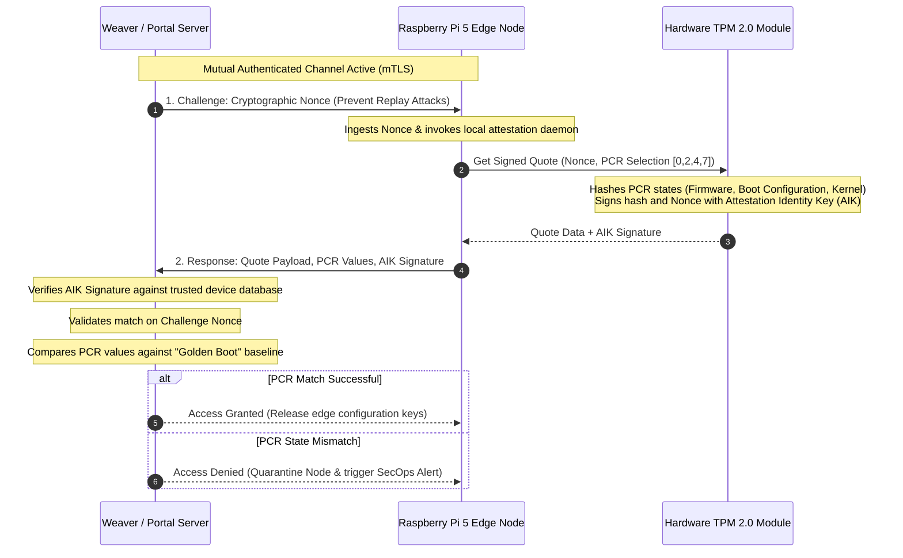

# TPM Remote Attestation Flow

This diagram illustrates the zero-trust attestation protocol used to verify Raspberry Pi 5 edge node platform integrity before granting network access.

```mermaid
sequenceDiagram
 autonumber
 participant Server as Weaver / Portal Server
 participant Pi as Raspberry Pi 5 Edge Node
 participant TPM as Hardware TPM 2.0 Module

 Note over Server, Pi: Mutual Authenticated Channel Active (mTLS)

 Server->>Pi: 1. Challenge: Cryptographic Nonce (Prevent Replay Attacks)
 Note over Pi: Ingests Nonce & invokes local attestation daemon
 Pi->>TPM: Get Signed Quote (Nonce, PCR Selection [0,2,4,7])
 Note over TPM: Hashes PCR states (Firmware, Boot Configuration, Kernel)<br/>Signs hash and Nonce with Attestation Identity Key (AIK)
 TPM-->>Pi: Quote Data + AIK Signature
 Pi->>Server: 2. Response: Quote Payload, PCR Values, AIK Signature

 Note over Server: Verifies AIK Signature against trusted device database
 Note over Server: Validates match on Challenge Nonce
 Note over Server: Compares PCR values against "Golden Boot" baseline

 alt PCR Match Successful
 Server-->>Pi: Access Granted (Release edge configuration keys)
 else PCR State Mismatch
 Server-->>Pi: Access Denied (Quarantine Node & trigger SecOps Alert)
 end
```
